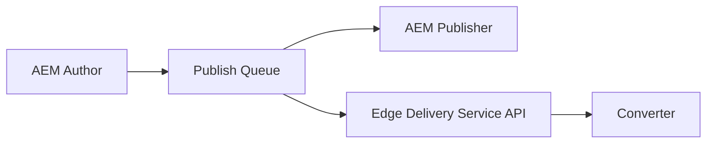

# Your Project's Title...
Your project's description...

## Environments
- Preview: https://main--24petwatch--hlxsites.hlx.page/
- Live: https://main--24petwatch--hlxsites.hlx.live/

## Installation

```sh
npm i
```

## Linting

```sh
npm run lint
```

## Local development

1. Create a new repository based on the `helix-project-boilerplate` template and add a mountpoint in the `fstab.yaml`
1. Add the [helix-bot](https://github.com/apps/helix-bot) to the repository
1. Install the [Helix CLI](https://github.com/adobe/helix-cli): `npm install -g @adobe/helix-cli`
1. Start Franklin Proxy: `hlx up` (opens your browser at `http://localhost:3000`)
1. Open the `{repo}` directory in your favorite IDE and start coding :)

## Setup

### Publishing pipeline



### CDN Setup

The CDN has the following configuration:
* `main--24petwatch--hlxsites.hlx.live` will handle `/blocks/*`, `/blog*`, `/styles/*`, `/scripts/*`
* `main--24petwatch-crosswalk-prod--hlxsites.hlx.live` will handle `/`, `/ca`, `/media`, `/fragments/*`
* `author-pXXXXXX-eYYYYY.adobeaemcloud.com/` will handle the rest
